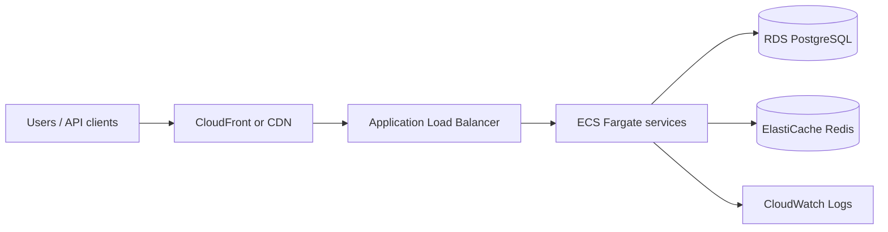

# FlowForge — production-style infrastructure (AWS example)

This document sketches how FlowForge could be deployed for production. It complements the local `docker-compose.yml` stack.

## High-level architecture

## Choices

| Concern | Choice | Reason |
|--------|--------|--------|
| **API** | ECS Fargate behind ALB | No server management; scale on CPU/RPS; fits Spring Boot JAR |
| **DB** | RDS PostgreSQL Multi-AZ | ACID for tenants, workflows, runs; automated backups |
| **Cache / rate limit** | Elastiache Redis | Shared rate-limit counters; optional session blacklist for JWT revocation |
| **Secrets** | AWS Secrets Manager | JWT secret, DB password, OpenAI key rotation |
| **Observability** | CloudWatch + optional OpenTelemetry | Logs from containers; metrics from ALB and JVM |
| **Frontend** | S3 + CloudFront | Static SPA; API on `api.` subdomain with CORS |

## Scaling

- **Horizontal**: increase Fargate task count; stateless API + JWT.
- **Workflow execution**: today the engine runs inside the API process (`@Async`). At higher scale, move execution to a **worker service** consuming a queue (SQS) so API stays responsive.
- **WebSockets**: use **sticky sessions** on the ALB or migrate to a broker (Redis Pub/Sub, SNS) so events fan out across instances.

## Data

- **Transactional data** remains in PostgreSQL (tenants, users, workflow versions, run metadata).
- **High-volume step logs**: stored in `step_run_logs` / `step_runs.logs` (relational). For very large deployments, **append logs to S3** or a document store keyed by `run_id`, with metadata in Postgres.

## Index optimization

Migration `V2__add_metrics_composite_index.sql` adds `(tenant_id, status, created_at DESC) INCLUDE (duration_ms)` to align dashboard aggregates with an index-friendly plan. Run `EXPLAIN (ANALYZE, BUFFERS)` on production-like data to validate.
